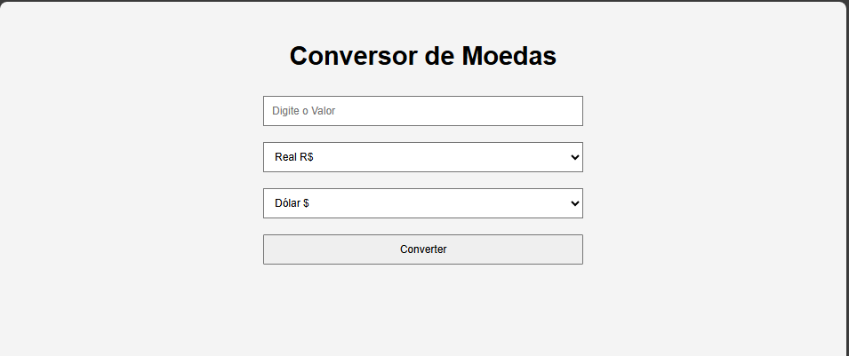

<h1 align="center"> Conversor de Moedas </h1>

Projeto Portfólio em HTML, CSS e JAVASCRIPT.  

  <a href="#-tecnologias">Tecnologias</a>&nbsp;&nbsp;&nbsp;|&nbsp;&nbsp;&nbsp;
  <a href="#-projeto">Projeto</a>&nbsp;&nbsp;&nbsp;|&nbsp;&nbsp;&nbsp;
  <a href="#-layout">Layout</a>&nbsp;&nbsp;&nbsp;|&nbsp;&nbsp;&nbsp;
  <a href="#memo-licença">Licença</a>

 

  

## 🚀 Tecnologias

Esse projeto foi desenvolvido com as seguintes tecnologias:

- Html
- Css
- JavaScript
- Git e Github

## 💻 Projeto

Página de Conversão de Moedas de Dolar para Real e de Real para Dolar.

- [Acesse o projeto finalizado, online](https://schubertsantos.github.io/conversor-de-moedas)

## 🔖 O que foi aprendido nesse Projeto de Estudos

- Página de Conversão de Moedas tanto de Dólar para Real quanto de Real para Dolar. 
- Utilizado o JavaScript para buscar informações de valores digitados pelo usuário e também exibir a conversão na tela. 

---

